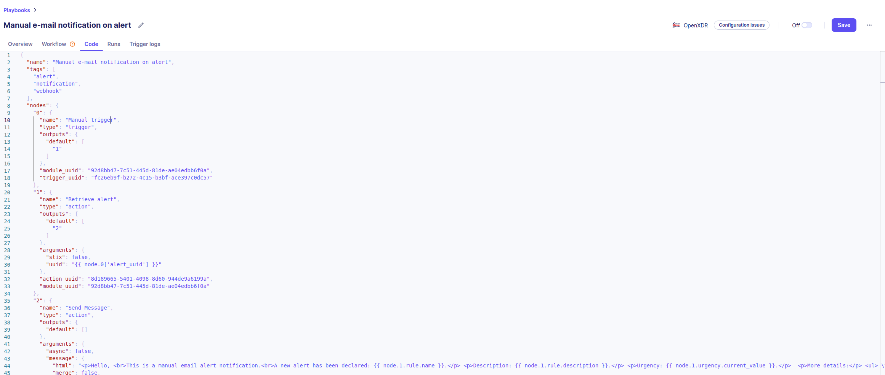

# Playbooks format JSON Schema

Sekoia.io playbooks are JSON documents, conforming to the following JSON schema.

You can freely use this open specification to share and publish playbook templates that will be instantly usable in a Sekoia.io community.

[sekoiaio_playbooks.schema.json](sekoiaio_playbooks.schema.json)
```javascript
{
  "$schema": "http://json-schema.org/draft-07/schema#",
  "type": "object",
  "description": "JSON format of a Sekoia.io Playbook (also known as SPL, Symphony Playbook Language). A playbook is a graph of nodes (of type 'action', 'trigger' or 'operator') found under the 'nodes' property, keyed by integer strings. Nodes can be connected to eachother via arguments and outputs, who can take JINJA 3 template values to refer to other nodes' data",
  "properties": {
    "name": {
      "type": "string",
      "description": "Name of the playbook template"
    },
    "uuid": {
      "type": "string",
      "format": "uuid",
      "description": "A globally unique template identifier"
    },
    "nodes": {
      "type": "object",
      "patternProperties": {
        "^[0-9]+$": {
          "type": "object",
          "properties": {
            "name": {
              "type": "string",
              "description": "User-defined node name"
            },
            "type": {
              "type": "string",
              "enum": ["trigger", "action", "operator"],
              "description": "Type of the node, see https://docs.sekoia.io/xdr/features/automate/"
            },
            "icon": {
              "type": "string",
              "description": "Node icon's URI (can use Data URIs here)"
            },
            "outputs": {
              "type": "object",
              "properties": {
                "default": {
                  "type": "object",
                  "description": "Default node output"
                }
              },
              "description": "Node outputs, each output is a nested property"
            },
            "loop": {
              "type": "array",
              "items": {
                "type": "string"
              },
              "description": "The number of loop iterations for Foreach-like operators"
            },
            "subtype": {
              "type": "string",
              "enum": ["foreach"],
              "description": "When type is 'operator', this is the operator's type (e.g., foreach)"
            },
            "items": {
              "type": "string",
              "description": "For Foreach-like operators, a jinja expression to an array of items to iterate through"
            },
            "module_uuid": {
              "type": "string",
              "format": "uuid",
              "description": "The UUID of a sekoia-automation-library module" // (1)!
            },
            "trigger_uuid": {
              "type": "string",
              "format": "uuid",
              "description": "(for triggers only) the UUID of the sekoia-automation-library" // (2)!
            },
            "action_uuid": {
              "type": "string",
              "format": "uuid",
              "description": "(for actions only) the UUID of the sekoia-automation-library action" // (3)!
            },
            "arguments": {
              "type": "object",
              "properties": {
              },
              "additionalProperties": true,
              "description": "Input arguments to the action or trigger, conforming to the action's own arguments JSON schema" // (4)!
            }
          },
          "required": ["name", "type", "outputs"]
        }
      }
    },
    "workspace": {
      "type": "string",
      "description": "A user-defined category of automation this template is made for" // (5)!
    },
    "description": {
      "type": "string",
      "description": "A comprehensive description of the process automated by this playbook"
    }
  },
  "required": ["name", "uuid", "nodes", "workspace", "description"]
}
```

1. Each Sekoia.io automation module is identified by a UUID, see, *e.g.*, [https://github.com/SEKOIA-IO/automation-library](https://github.com/SEKOIA-IO/automation-library) under `<the module>/manifest.json` to find your desired module's UUID
2. Triggers are identified by a UUID, see, *e.g.*, [https://github.com/SEKOIA-IO/automation-library/blob/main/Sekoia.io/trigger_sekoiaio_alert_created.json#L90](https://github.com/SEKOIA-IO/automation-library/blob/main/Sekoia.io/trigger_sekoiaio_alert_created.json#L90)
3. Actions are identified by a UUID, see, *e.g.*, [https://github.com/SEKOIA-IO/automation-library/blob/main/Sekoia.io/action_get_an_alert.json#L2](https://github.com/SEKOIA-IO/automation-library/blob/main/Sekoia.io/action_get_an_alert.json#L2)
4. Each action/trigger/operator defines its own arguments and outputs JSON schema, see, *e.g.*, [https://github.com/SEKOIA-IO/automation-library/blob/main/Sekoia.io/action_get_an_alert.json#L7](https://github.com/SEKOIA-IO/automation-library/blob/main/Sekoia.io/action_get_an_alert.json#L7)
5. You can freely define any "workspace" that is meaningful to your SOC's playbook families, see [https://github.com/SEKOIA-IO/Community/tree/main/playbooks/templates](https://github.com/SEKOIA-IO/Community/tree/main/playbooks/templates) for inspiration.

### Upload a JSON playbook to your Sekoia.io community

Active Sekoia.io Defend subscribers can upload a playbook to their community from any source via [a POST API endpoint](https://docs.sekoia.io/xdr/develop/rest_api/playbooks/#tag/Playbooks/operation/post_playbooks_resource) or via copy-paste in the Code tab:

{: style="max-width:100%"}

Example python code:
```python
import requests
requests.post(
  "https://api.test.sekoia.io/v1/symphony/playbooks",
  headers={
    "Authorization": "Bearer <YOUR API_KEY>",
    "Content-Type": "application/json",
  },
  json={
    "playbook":{
      "name": "Manual e-mail notification on alert",
      "description": "Send an email about an alert when receiving a webhook event",
      "community_uuid": "<YOUR COMMUNITY_UUID>", # (1)!
      "tags": [
        "alert",
        "notification",
        "webhook"
      ],
      "nodes": {
        "0": {
          "name": "Manual trigger",
          "type": "trigger",
          "outputs": {
            "default": [
              "1"
            ]
          },
          "trigger_uuid": "fc26eb9f-b272-4c15-b3bf-ace397c0dc57" # (2)!
          "module_uuid": "92d8bb47-7c51-445d-81de-ae04edbb6f0a", # (3)!
        },
        "1": {
          "name": "Retrieve alert",
          "type": "action",
          "outputs": {
            "default": [
              "2"
            ]
          },
          "arguments": { # (4)!
            "stix": False,
            "uuid": "{{ node.0['alert_uuid'] }}"
          },
          "action_uuid": "8d189665-5401-4098-8d60-944de9a6199a",
          "module_uuid": "92d8bb47-7c51-445d-81de-ae04edbb6f0a"
        },
        "2": {
          "name": "Send Message",
          "type": "action",
          "outputs": {
            "default": []
          },
          "arguments": {
            "async": False,
            "message": { # (5)!
              "html": "<p>Hello, <br>This is a manual email alert notification.<br>A new alert has been declared: {{ node.1.rule.name }}.</p> <p>Description: {{ node.1.rule.description }}.</p> <p>Urgency: {{ node.1.urgency.current_value }}.</p>  <p>More details:</p> <ul> \t <li>Entity name: {{ node.1.entity.name }}</li>\t <li>Alert type category: {{ node.1.alert_type.value }}</li> <li>Kill Chain: {{ node.1.kill_chain_short_id }}</li>\t <li>Created at: {{ node.1.created_at|timestamp_to_iso8601 }}</li> <li>Source: {{ node.1.source | replace(\".\", \"[.]\", 1) }}</li> \t <li>Target: {{ node.1.target | replace(\".\", \"[.]\", 1) }}</li> <li>Check https://app.sekoia.io/sic/alerts/{{ node.1.short_id }} for more information.</li> </ul><br>  <ul><p>Comments:</p>      <li>{{ comment.content }}</li>  </ul><br>  <ul><p>Countermeasures:</p>      <li>{{ countermeasure.description }}</li>  </ul><br>",
              "merge": False,
              "subject": "A new alert concerning rule {{ node.1.rule.name }} has been created.",
              "auto_html": False,
              "auto_text": False,
              "from_name": "Example.fr",
              "important": False,
              "from_email": "no-reply@example.fr",
              "track_opens": False,
              "track_clicks": False,
              "url_strip_qs": False,
              "view_content_link": False,
              "preserve_recipients": False
            }
          },
          "action_uuid": "cb61842a-e09f-417d-acdf-34c818c61c87",
          "module_uuid": "bc2699a6-93e5-4d74-816d-4186d6eb3ce8"
        }
      }
    }
  }
)
```

1. Replace with your community UUID (your API key must have the permission to create playbooks on this community)
2. This is the UUID of the trigger used by the node, see [https://github.com/SEKOIA-IO/automation-library/blob/6ca40519b71586a82a12792fd2636514708687d5/Sekoia.io/trigger_sekoiaio_alert_webhook.json#L24](https://github.com/SEKOIA-IO/automation-library/blob/6ca40519b71586a82a12792fd2636514708687d5/Sekoia.io/)
3. This is the UUID of the module where our trigger is defined, see [https://github.com/SEKOIA-IO/automation-library/blob/6ca40519b71586a82a12792fd2636514708687d5/Sekoia.io/manifest.json#L13](https://github.com/SEKOIA-IO/automation-library/blob/6ca40519b71586a82a12792fd2636514708687d5/Sekoia.io/manifest.json#L13)
4. Nodes' `argument` property should conform to the trigger/operator/action's own JSON schema, see [https://github.com/SEKOIA-IO/automation-library/blob/6ca40519b71586a82a12792fd2636514708687d5/Sekoia.io/action_get_an_alert.json#L6](https://github.com/SEKOIA-IO/automation-library/blob/6ca40519b71586a82a12792fd2636514708687d5/Sekoia.io/action_get_an_alert.json#L6)
5. You may use [JINJA 3](https://jinja.palletsprojects.com/en/3.0.x/) interpolation to reference other modules' outputs and variables
