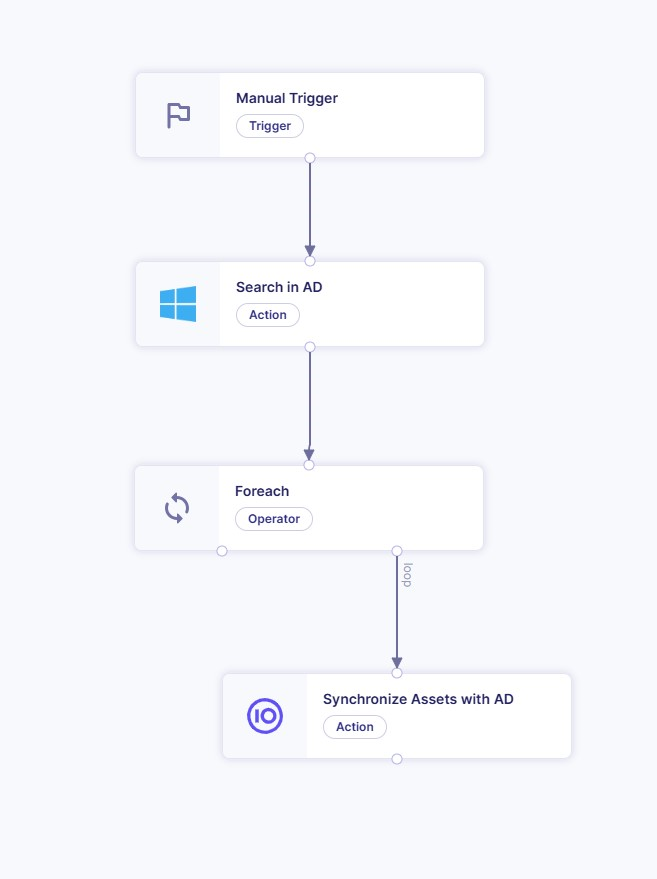

# Synchronize Assets in Sekoia with Your Active Directory

Sekoia's asset discovery functionality automatically creates assets based on information visible in events. Depending on your configuration or intake sources, you might have multiple assets in Sekoia corresponding to the same real user, host or account. 

For example, consider the following scenarios:
- **Source Log 1:** Users are identified by an ID.
- **Source Log 2:** Users are identified by a name.
- **Source Log 3:** Users are identified by an email address.

If an event does not simultaneously contain the ID and the name, Sekoia cannot create a single asset with all the correct information. As a result, you will end up with multiple assets, each reflecting one detection property of the user.

This article demonstrates how to leverage the content of your Active Directory (AD) to enhance the quality of your asset database in Sekoia by consolidating asset information based on your AD data.

## How Does It Work?

The implementation of the playbook to synchronize assets with AD is based on the playbook action [`Synchronize-asset-with-ad`](../../../integration/action_library/sekoia-io.md#synchronize-assets-with-ad).

## Prerequisites

Before setting up the synchronization, ensure the following prerequisites are met:

- **Active Directory with Clean Data:** Ensure there is one entry per user/account in AD, containing all the detection properties needed.
- **Proper Credentials:** The user configuring the playbooks must have the necessary credentials to access Active Directory. Additionally, this user should understand how data is organized within AD.

## Setting Up Your Playbook to Synchronize Assets with AD

### Create Your Playbook

To understand and test this action, you can start with a basic playbook comprising four nodes:

1. **Manual Trigger:** Start with a manual trigger using the default configuration [module documentation](../../features/automate/triggers.md#manual-trigger-webhook).
2. **Search in AD Action:** Configure this node to read data from your Active Directory [module documentation](../../../integration/action_library/microsoft-active-directory.md#search-in-ad).
3. **ForEach Operator:** Loop over the result of the AD search action. For the configuration, use the output of the Search in AD node, referencing it as `{{ node.X.search_result }}` [module documentation](../../features/automate/operators.md#foreach).
4. **Synchronize Assets with AD Action:** This node will handle the synchronization based on the looped AD entries [module documentation](../../../integration/action_library/sekoia-io.md#synchronize-assets-with-ad).

Here's a screenshot of the playbook structure:




### Configure the Synchronize Assets with AD Action

This action requires three configuration parameters:

1. **Community UUID:** The Community UUID of the assets you are synchronizing. You can obtain your Community UUID from the Sekoia app URL on the settings page.

2. **User AD Data:** The JSON output of a single AD entry. Use the output from the ForEach loop, referencing it as `{{ node.X.default.value }}`.

3. **Asset Synchronization Configuration:** A JSON object that defines how to synchronize the asset with Active Directory. The JSON must be structured as follows:

    ```json
    {
      "asset_name_field": "displayName",
      "detection_properties": {
        "email": ["mail"],
        "username": ["cn", "name", "displayName"]
      },
      "contextual_properties": {
        "title": "title",
        "division": "division"
      }
    }
    ```

    - **asset_name_field:** This should match the name of the field in your Active Directory that Sekoia will use as the Asset Name in the platform.
    
    - **detection_properties:** This section maps Sekoia Detection properties (e.g., `email`, `username`) to their corresponding Active Directory fields. This ensures that assets are correctly identified and consolidated based on these properties [Detection properties documentation](../../features/collect/assets.md#detection-properties).
    
    - **contextual_properties:** These are additional contextual details you want to add to your assets. You can define any relevant properties here, associating them with corresponding AD fields [Contextual properties documentation](../../features/collect/assets.md#contextual-properties).

#### Example Configuration

Suppose you have a user in Active Directory with the following data:

```json
{
  "displayName": "John Doe",
  "mail": "john.doe@example.com",
  "cn": "jdoe",
  "name": "John",
  "title": "Senior Developer",
  "division": "Engineering"
}
```

Using the above `Asset Synchronization Configuration`, Sekoia will create or update an asset as follows:

- **Asset Name:** `John Doe` (from `displayName`)
- **Detection Properties:**
  - **Email:** `john.doe@example.com` (from `mail`)
  - **Username:** `jdoe`, `John`, `John Doe` (from `cn`, `name`, `displayName`)
- **Contextual Properties:**
  - **Title:** `Senior Developer` (from `title`)
  - **Division:** `Engineering` (from `division`)

This configuration ensures that all relevant information about "John Doe" is consolidated into a single asset in Sekoia, regardless of how the user is identified across different data sources.

## Asset Management Capabilities

The synchronization module can perform the following actions to maintain asset integrity:

- **Merge Assets:** Combine multiple assets that represent the same user based on detection properties.
- **Edit Assets:** Update existing assets with the latest information from AD.
- **Create Assets:** Add new assets for users present in AD but not yet in Sekoia.

By executing these actions, the synchronization process ensures that your Sekoia asset database accurately reflects the current state of your Active Directory, maintaining a single, comprehensive asset per real user.

## Monitoring Synchronization Actions

You can monitor the actions performed by the synchronization playbook through the Run Tab. The output of the action run will provide detailed information about the changes made to assets, including creations, updates and merges of assets.
